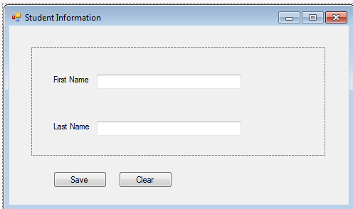

## 들어가며
---
스프링 프레임워크를 공부하고 있다면 IoC, DIP, DI와 같은 용어가 익숙할 것이다. 해당 용어를 우리나라 말로 풀이하면 각각 제어의 역전, 의존성 주입, 의존관계 역전 원칙이다. 단어의 의미가 매우 추상적이기 때문에 해당 개념을 이해하기 어렵다. 이번 포스팅을 통해 해당 개념들을 정리하고자 한다.
왜 중요한 개념인지. 

&nbsp;
## 디자인 원칙과 디자인 패턴
---
IoC, DIP, DI, IoC container와 같은 개념을 이해하려면 먼저 **설계 원칙(Design Principle)**과 **설계 패턴(Design Pattern)**의 차이를 이해해야한다.

#### 설계 원칙(Design Principle)
- 높은 품질의 소프트웨어를 개발하기 위한 고수준(high-level)의 가이드라인이다.
- 구현방식을 명시하지 않고, 프로그래밍 언어에 종속되지 않는다.
- SOLID(SRP, OCP, LSP, ISP, DIP)는 가장 널리 사용되는 디자인 원칙 중 하나다.

#### 설계 패턴(Design Pattern)
- 객체지향 프로그래밍에서 발생하는 문제를 해결하기 위한 저수준(low-level)의 솔루션(구현방식)을 제안한다.
- 한 번에 하나의 객체만 가질 수 있는 싱글톤(Singleton) 디자인 패턴은 한 예시다.

제어의 역전(IoC)과 의존관계 역전 원칙(DIP)은 어플리케이션의 클래스를 디자인하기 위해 사용되는 고수준의 **디자인 원칙(Design Principle)**이다. 따라서 어플리케이션 개발을 위한 가이드라인을 제공하지만, 어떠한 구현 방식도 제공하지 않는다.

의존성 주입(DI)은 설계를 위한 하나의 패턴이고, IoC 컨테이너는 프레임워크의 한 종류다.


&nbsp;
## 제어의 역전(IoC: Inversion of Control)
---
제어의 역전(IoC)은 **디자인 원칙**의 한 종류로 다양한 제어권을 반전시켜 객체지향 디자인에서 **느슨한 결합을(loose coupling)** 가능하게 한다. 여기서 제어권은 프로그램 흐름에 대한 제어, 객체 생성에 대한 제어, 종속 객체의 생성 및 바인딩이 포함된다.

제어의 역전을 쉽게 이해하기 위해서 운전을 예로 들어보겠다. 만약 당신이 회사로 출근하기 위해 자동차를 직접 운전한다면, 자동차의 제어권은 당신에게 있는 것이다. 그런데 당신이 운전 기사를 고용하고 그에게 운전을 맡긴다면, 자동차에 대한 제어권은 운전 기사에게 넘어가게 된다. 이것이 제어의 역전이다.

그렇다면 제어의 역전은 무슨 장점이 있는 것일까? 제어의 역전은 느슨한 결합을 가능하게 하여 프로그램을 더 쉽게 테스트 할 수 있도록 하고, 유지하기 쉽게 하며 확장성을 가지게 한다.

&nbsp;
### 프로그램 흐름 제어
일반적인 콘솔 어플리케이션은 메인 함수에서 실행된다. 메인 함수는 프로그램의 실행 흐름을 제어한다. 쉽게 말하면 사용자와 상호작용 하는 순서를 결정한다. 아래의 자바 콘솔 프로그램을 예로 들어보자.

```java
public class Program {

    public static void main(String[] args) {
        Scanner sc = new Scanner(System.in);
        boolean continueExecution = true;

        while (continueExecution) {
            System.out.println("Enter First Name: ");
            String firstName = sc.nextLine();

            System.out.println("Enget Last Name: ");
            String lastName = sc.nextInt();

            System.out.println("Do you want to save it? Y/N: ");
            String wantToSave = sc.nextLine();
            if(wantToSave.equals("Y")) {
                saveToDB(firstName, lastName);
            }

            System.out.println("Do you want to Exit? Y/N: ");
            String wantToExit = sc.nextLine();
            if(wantToExit.equals("Y")) {
                continueExecution = false;
            }
        }
    }

    public static void saveToDB(String firstName, String lastName) {
        // save first name and last name to database here...
    }
}
```

위 코드에서 프로그램 클래스(Program)의 메인함수(main)는 프로그램의 흐름을 제어한다. 위 프로그램은 사용자의 성과 이름을 차례대로 입력받는다. 그리고 사용자의 입력에 따라 데이터를 저장할 지 결정하고, 프로그램의 종료 여부를 결정한다. 따라서 프로그램의 흐름은 `메인함수`에 의해서 제어된다고 할 수 있다.


위의 콘솔 프로그램을 GUI 기반의 애플리케이션으로 작성하면 쉽게 제어의 역전이 적용된다. 윈도우 기반 애플리케이션의 프레임워크는 `이벤트`를 사용하여 프로그램의 흐름을 제어할 것이다. 즉, 프로그램의 제어권이 메인함수에서 `프레임워크`로 역전된 것이다.


&nbsp;
### 종속 객체 생성 제어
종속 객체를 생성할 때도 제어의 역전이 적용될 수 있다. 이를 설명하기에 앞서 종속성(Dependency)이 무엇인지 다음 예제 코드를 통해 살펴보자.

```java
public class A {

    private B b;

    public A() {
        b = new B();
    }

    public void task() {
        // do something..
        b.someMethod();
        // do something..
    }
}

public class B {

    public void someMethod() {
        // do something..
    }
}
```

위의 예제에서 클래스A는 task()의 작업을 완료하기 위해서 b.someMethod()를 호출한다. 클래스A는 클래스B의 도움 없이는 task() 작업을 완료할 수 없다. 다른 말로 "클래스A는 클래스B에 의존적이다" 혹은 "클래스B는 클래스A의 의존성(Dependency)이다"라고 할 수 있다.

객체 지향 디자인 접근 방식에서 클래스들은 어플리케이션의 기능을 완성하기 위해서 서로 상호 작용 해야 한다. 위의 예제에서 클래스A는 클래스B(의존성 클래스)의 오브젝트를 생성하고 생명 주기를 관리한다.

제어의 역전 원칙은 제어의 권한을 다른 클래스로 위임하는 것이다. 다른 말로 종속성 생성 제어를 클래스A에서 다른 클래스로 반전시키는 것을 의미한다. 아래의 코드를 살펴보자.

```java
public class A {

    B b;

    public A() {
        b = Factory.getObjectOfB();
    }

    public void task() {
        // do something..
        b.someMethod();
        // do something..
    }
}

public class Factory {

    public static B getObjectOfB() {
        return new B();
    }
}
```

위 코드에서 확인할 수 있는 것처럼 클래스A는 클래스B의 객체를 얻기 위해 Factory 클래스를 이용한다. 따라서 우리는 종속 객체 생성의 제어를 클래스A에서 Factory 클래스로 반전시킨 것이다. A 클래스는 더 이상 B 클래스의 오브젝트를 생성하지 않고, 대신 Factory 클래스를 이용하여 B 클래스의 오브젝트를 얻는다.

조금 더 실용적인 예제를 살펴보자.

객체 지향 설계에서 클래스들은 느슨하게 결합되는 방식으로 설계 돼야 한다. 느슨한 결합이란 한 클래스의 변화가 다른 클래스를 현화시키도록 하지 않는 다는 것을 의미한다. 따라서 느슨한 결합은 애플리케이션의 유지/보수성을 높여준다. n-tier 아키텍처를 통해 이를 이해해보자.

전형적인 n-tier 아키텍처에서 UI(User Interface)는 데이터를 주고받기 위해서 서비스 계층과 상호작용한다. 서비스 계층은 데이터에 대한 비즈니스 룰을 적용하기 위해 비즈니스 로직 계층과 상호작용 한다. 그리고 비즈니스 로직 클래스는 데이터베이스에서 데이터를 얻거나 저장하기 위해 데이터 접근 객체에 의존한다. 이것이 가장 단순한 n-tier 아키텍처 디자인이다. IoC를 이해하기 위해 BusinessLogic과 DataAccess 클래스에 집중해보자.


## 참고 문헌
https://engkimbs.tistory.com/602

https://www.baeldung.com/inversion-control-and-dependency-injection-in-spring

https://www.tutorialsteacher.com/ioc/inversion-of-control
